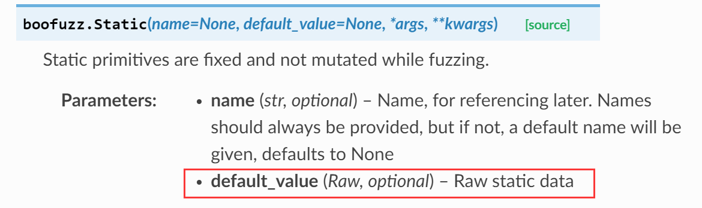
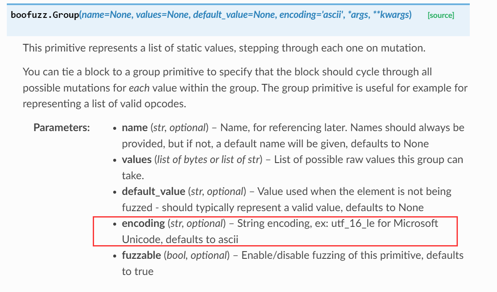

# [Boofuzz](https://boofuzz.readthedocs.io/en/stable/) 框架探究

## 前言

由于 [Boofuzz](https://boofuzz.readthedocs.io/en/stable/) 是本漏挖系统的核心，所以值得花费大量的时间来研究该框架的用法。

Boofuzz 模糊测试的核心就在于原语对象的构建。当我们完成了原语的构建，Boofuzz 就会调用其**变异引擎**对原语进行变异，最后通过 Boofuzz 内置的 Connection 类发送到目标。

由于我们仅关注 Boofuzz 的使用，所以对于变异引擎无需了解太多。（当然，若以后希望开发自己的模糊测试器或是进一步提升模糊测试的成功率，就需要关注变异引擎这部分了）

Boofuzz 中针对不同的字段格式定义了许多内置的原语，同时 Boofuzz 也允许我们自定义一个新的原语。下文针对 Boofuzz 的使用进行一些简单的记录。

---

## 协议定义

### 原语

---

#### Static

顾名思义，[Static](https://boofuzz.readthedocs.io/en/stable/user/protocol-definition.html#static) 原语就是在模糊测试时不进行变异的原语，主要用来描述一些固定的静态字段。



可能会有的疑问是 default_value 应该传入何种类型的参数？后续我会测试一下。

---

#### Simple

TODO

---

#### Delim

Delim 原语用于对起到分隔符作用的字符进行变异，比如常见的 \r、\n、= 、空格等字符。变异的操作包括重复、替换、缺失等。在官方给出的针对 HTTP 协议进行简单模糊测试的[脚本](https://github.com/jtpereyda/boofuzz/blob/8e2aac764fa827955621edb4c2da0e0b2a652190/examples/http_simple.py)中就用到了该原语。

---

#### [Group](https://boofuzz.readthedocs.io/en/stable/user/protocol-definition.html#group)

Group 原语含有一个由固定值组成的列表，在模糊测试的时候会依次取出该列表中的每个值并生成其所有可能的变异用于模糊测试。该原语常见的用途是表示一列有效的操作码。



可能会有的疑问是 encoding 参数怎样使用？后续会进行补充。

---

### Blocks

#### Size

问题2：如何根据数据的长度确定某个长度字段的值？

解决方案：利用 Boofuzz 的 [Size](https://boofuzz.readthedocs.io/en/stable/user/protocol-definition.html#size) 类来定义长度字段。

问题3：定义完一个原语之后，如何在模糊测试时再次修改该原语的值？

解决方案：

1. boofuzz 提供了一个 ProtocolSessionReference，不过这个字段更多是起到一个占位符的作用，实际的值在模糊测试的回调函数中设置。那么 ProtocolSessionReference 的用法是怎样的呢？


问题4：模糊测试时如何获取当前被fuzz的请求对象？

解决方案：调用 session.fuzz_node 即可

#### Request

Request 对象是模糊测试的“终点”，在进行模糊测试时，Request 对象会被转换成原始的字节串，并被转发给变异引擎进行变异。

在 Request 类的 render() 方法中实现了上述的转换过程，简单地说，当在一个 Request 对象上调用 render() 方法，就可以得到一个原始字节串，示例如下：

```python
from boofuzz.primitives import Byte
from boofuzz.blocks import Request, Block

test = Block("parameter2", children=(Byte("test", 0x1)))
a = Request("request_download", children=(test))
tmp = a.render()
print(tmp)  # b'\x01

```

- Request 实际上是一个顶级的 Block，也就是说，Block 可含有的任意原语，Request 也可含有。

#### Repeat

问题1：当需要重复使用一个相同的字段/字段组时，有什么办法可以简洁地表达这种重复呢？

TODO，可以参看 [Repeat](https://boofuzz.readthedocs.io/en/stable/user/protocol-definition.html#repeat)。

## Boofuzz 特性探究

1. 对于某个不进行变异的原语调用 session.fuzz()，Boofuzz 并不会将该原语原样发送出去，而是直接报告模糊测试完成，这在一个多流程的数据包 fuzzing 中可能是一个不方便的点。
2. 