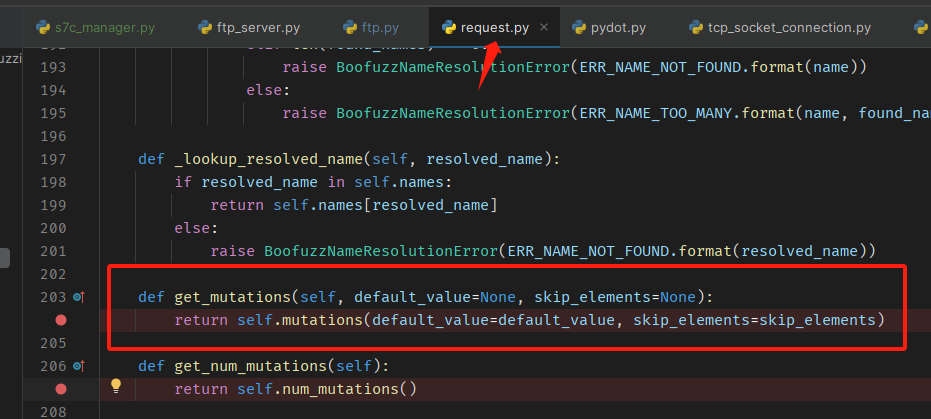

# Boofuzz 框架探究

由于 Boofuzz 是本漏挖系统的核心，所以值得花费大量的时间来研究该框架的用法。

## 原语

### Blocks

#### [Repeat](https://boofuzz.readthedocs.io/en/stable/user/protocol-definition.html#repeat)

问题1：当需要重复使用一个相同的字段/字段组时，有什么办法可以简洁地表达这种重复呢？

TODO

#### Size

问题2：如何根据数据的长度确定某个长度字段的值？

解决方案：利用 Boofuzz 的 [Size](https://boofuzz.readthedocs.io/en/stable/user/protocol-definition.html#size) 类来定义长度字段。

问题3：定义完一个原语之后，如何在模糊测试时再次修改该原语的值？

解决方案：

1. boofuzz 提供了一个 ProtocolSessionReference，不过这个字段更多是起到一个占位符的作用，实际的值在模糊测试的回调函数中设置。那么 ProtocolSessionReference 的用法是怎样的呢？

问题4：在生成了一个 Request 对象后，该对象是怎样变成发送时的模糊测试数据的呢？



```python
    a2 = Request("mirror_test", children=(a, b, c ))
    t = a2.get_mutations()
    for i in t:
        print(i)
        print(i[0].value)
```

问题4：模糊测试时如何获取当前被fuzz的请求对象？

解决方案：调用 session.fuzz_node 即可